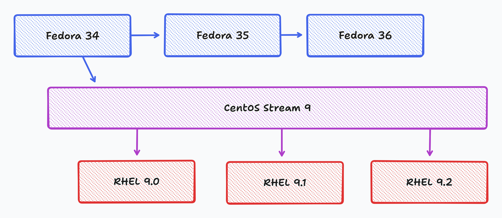
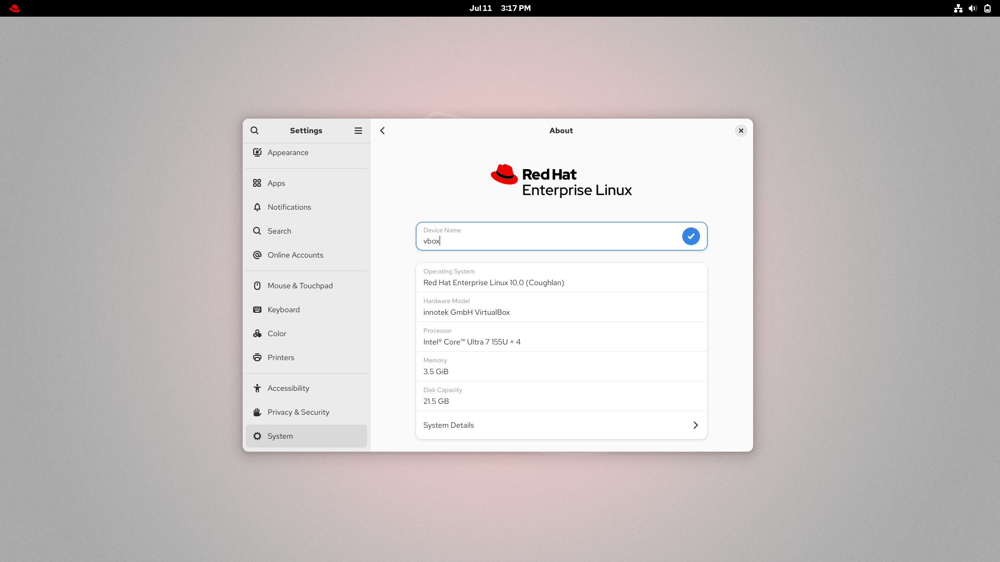
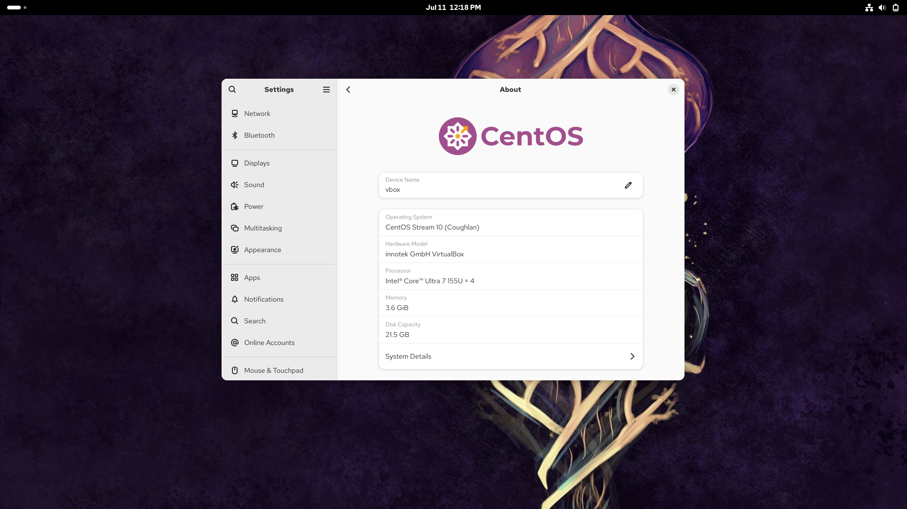
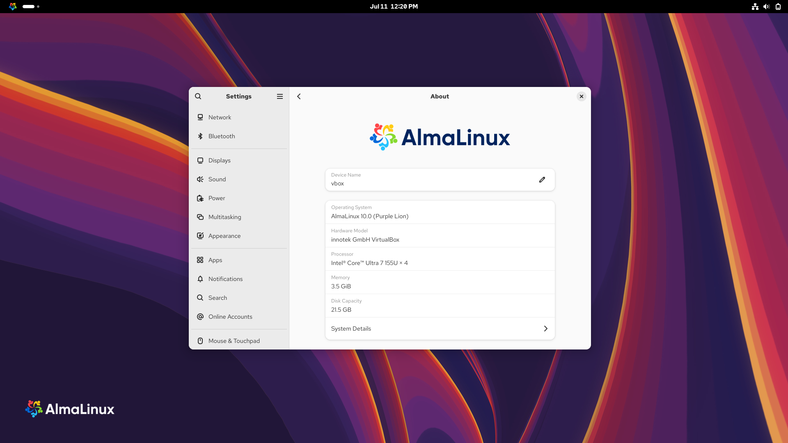
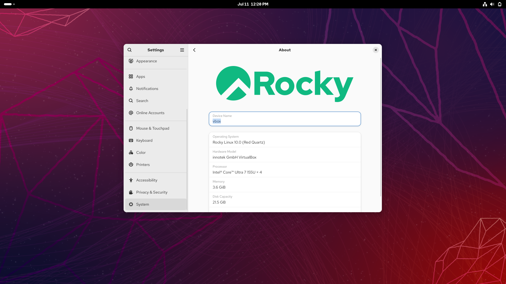
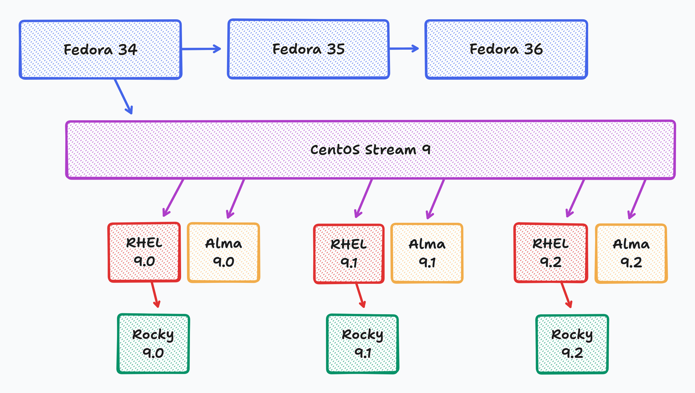
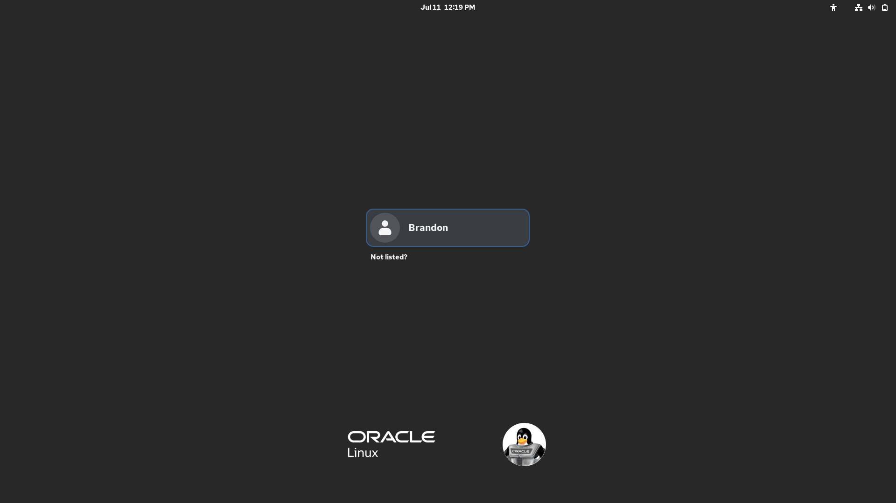
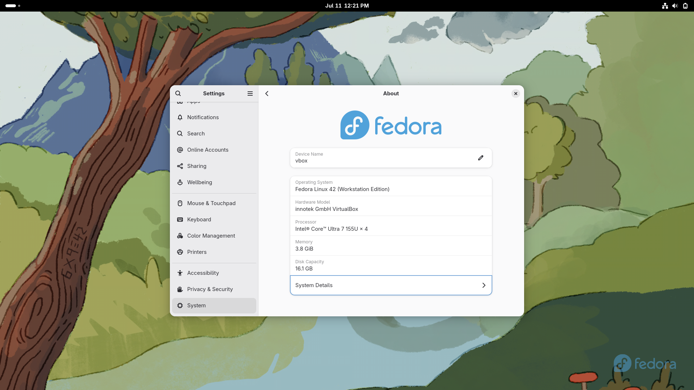

It's been a couple of years since we dropped a video/article on RHEL clones. However, a ton has changed since we wrote that video/article, and it has aged like milk. So, it's time for an update.

## Background
Let's start with some context on what's happening in the Enterprise Linux space. Red Hat Enterprise Linux (RHEL) is a distribution developed by Red Hat. It is a long-term support RPM distribution using the DNF package manager. Its package base comes from an earlier version of Fedora, but instead of the 13 months of support you get with each Fedora release, [each RHEL release gets 10 years of support and maintenance, and even more if you buy an extended support add-on](https://access.redhat.com/support/policy/updates/errata). This makes Fedora a kind of testing ground for many things that RHEL will incorporate in the future. For example, RHEL 10 (available 2 months at the time of this article) is based on Fedora 40, released in April 2024. It wouldn't be entirely inaccurate to call RHEL a "Fedora LTS". That said it is still worth noting that Fedora is still its altogether own project that Red Hat just sponsors, and they have made decisions before against Red Hat, for example [Fedora ships BTRFS as its default file system](https://fedoraproject.org/wiki/Btrfs), while [Red Hat 10 defaults to XFS and doesn't even support BtrFS](https://docs.redhat.com/en/documentation/red_hat_enterprise_linux/8/html/managing_file_systems/overview-of-available-file-systems_managing-file-systems).

Another thing that makes RHEL special is that a lot of the new technology being pushed in Linux right now is [either funded by Red Hat or run or heavily contributed to by Red Hat developers](https://www.redhat.com/en/about/open-source-program-office/contributions). There are numerous examples of this, such as GNOME Shell, Wayland, SystemD, PolicyKit, and many more.

But, the reason RHEL isn't widely used in the non-corporate Linux community is because RHEL is a paid Linux distribution. As a result, in the past, CentOS was a community-maintained Linux distribution that utilized Red Hat's package source code to rebuild everything, offering a free alternative to RHEL with community-backed support rather than corporate-backed support. Red Hat ultimately acquired them but continued to support CentOS for years afterward as a community-backed, free rebuild of RHEL.

However, in the year or so leading up to the previous RHEL clone video/article, Red Hat moved CentOS upstream. Previously, Fedora would release a version, then RHEL would inherit from Fedora to build a new RHEL release, and subsequently, CentOS would create a rebuild that the community could use. 

However, Red Hat is now built on top of CentOS Stream, which in turn inherits from Fedora. This change isn't a big deal and makes CentOS an even more useful project.

However, Red Hat completely fumbled the messaging instead of making this change only for CentOS 9 and likely encountering no community pushback from a simple change. They created a new version of CentOS called CentOS Stream, which is a distinct and separate version. Then, they discontinued the main version of CentOS 8 after it had already been released, which is not a good look for an LTS-style distribution like CentOS. This resulted in new community-backed clones of RHEL, such as AlmaLinux and Rocky Linux. Consequently, the community that adopted CentOS 8 was forced to migrate their systems to another RHEL clone.

[Red Hat made themselves look worse by removing access to Red Hat's source code for non-Red Hat customers](https://www.redhat.com/en/blog/furthering-evolution-centos-stream), which makes it harder for the community to rebuild RHEL. To be fair to Red Hat, it seems they didn't do this to target community-made rebuilds but instead to target companies like Oracle, which are making RHEL rebuilds with their support mode — essentially stealing Red Hat's business model on top of their product. [As a response, Oracle, CIQ (Rocky Linux), and SUSE formed the OpenELA as a group to provide open-source code for an RHEL rebuild](https://openela.org/blog/meet-openela-what-why-future/), and it also changed the purposes of some of the projects which I will go into more detail on later.

So, with all of this action happening in the Enterprise Linux space and all these newer options available. What the hell am I supposed to use if I don't want to pay for RHEL? Let's review the options.

### RHEL Free

Let's start with RHEL Free. [Red Hat offers a "no-cost developer subscription" aimed at individual users](https://developers.redhat.com/products/rhel/download). With this, you can use Red Hat on up to 16 systems for ["demos, prototyping, QA, small production uses, and cloud access"](https://developers.redhat.com/articles/faqs-no-cost-red-hat-enterprise-linux). Red Hat also recommends it for "personal servers, home labs, and small open-source communities."

The main problem with RHEL Free is you still need to register the system with the Subscription Manager and sign in with a Red Hat account. This is relatively simple to do, but it's still annoying if you want something to throw onto a home lab. However, if you are trying to learn Red Hat, you will receive the same version of RHEL with the free plan as you would if you were a paid subscriber. 

Additionally, one of the best features of Red Hat Free is that you gain access to all the documentation Red Hat offers for its Enterprise customers. I don't even use RHEL Free on my production systems. Still, I have a developer account to access their documentation because it is one of the best sources for documentation on Linux, and almost everything in its docs will apply to one of these other RHEL clones. So, if your use case is to learn Enterprise Linux, you can't beat RHEL Free.

### CentOS Stream

Now, let's move on to CentOS Stream. As I mentioned earlier, this is directly upstream of Red Hat so that any new fixes will appear in CentOS Stream first. However, this does make it marginally less stable than RHEL. CentOS Stream is still going to be far more stable than any non-LTS distribution, such as Fedora or a non-LTS Ubuntu. Additionally, since RHEL builds on top of CentOS Stream, the environment you are in is essentially RHEL, albeit with a few newer packages that address specific bugs. It's worth noting that CentOS Stream is the only way to contribute source code to Red Hat Enterprise Linux directly, as all changes are first made inside Stream before RHEL gets them. 

Now, if you're trying to run something important in production, I would still prefer an alternative rebuild, such as AlmaLinux, to gain that extra bit of stability. However, I wanted to run Enterprise Linux on a desktop for whatever reason. In that case, I prefer to run Stream on a desktop with its slightly newer packages compared to one of the other clones. It is also an excellent option for home labs. 

### AlmaLinux

Now, let's discuss some community-backed clones. First off, we have AlmaLinux. 

AlmaLinux was created in 2021 by CloudLinux after Red Hat killed CentOS 8. The goal was to build a drop-in alternative for CentOS users. In March 2021, [CloudLinux spun off AlmaLinux to have its own 501(c) non-profit, which gets a million dollars a year of funding from CloudLinux](https://www.businesswire.com/news/home/20210330005690/en/CloudLinux-Establishes-AlmaLinux-Open-Source-Foundation-Launches-First-Stable-Release). Originally, AlmaLinux was "bug-for-bug" compatible with RHEL which means that it was as close to RHEL as possible, and if you had a bug on RHEL you could reproduce it on Alma. However, after Red Hat restricted access to their source code, AlmaLinux became a binary-compatible clone, meaning that any program built for Red Hat will be compatible with Alma. This means it is no longer an exact duplicate of the original system; however, it is considered a bug if a program can run on RHEL but not AlmaLinux. 

AlmaLinux is my favorite RHEL clone because a whole community is built around it, and the community is starting to build some very cool things around AlmaLinux. For example, [AlmaLinux has their new Kitten version, which is a dev branch for future versions](https://almalinux.org/blog/2024-10-22-introducing-almalinux-os-kitten/) — kind of their version of CentOS Stream. Red Hat recently dropped support for older x86_64_v2 CPUs, but [AlmaLinux 10 supports those devices with their x86_64_v2 repo](https://almalinux.org/blog/2025-05-13-epel-10-kitten-v2/). Finally, there are several cool side projects underway in the AlmaLinux space, such as the [AlmaLinux Atomic SIG](https://wiki.almalinux.org/sigs/Atomic.html), which is working on building a special, immutable desktop variant of AlmaLinux. 

Outside of that, AlmaLinux tends to be the fastest RHEL clone to get updates when RHEL updates, and my AlmaLinux systems have just been super damn reliable. With this, AlmaLinux is the best option for most people who need to use an Enterprise Linux system for production but don't require the support packages that Red Hat provides for their systems.

### Rocky Linux

Next up is Rocky Linux. This is another community-backed RHEL clone that emerged following the demise of CentOS 8. It was founded in 2020 by Gregory Kurtzer, who claims to be a co-founder of CentOS and was named after Rocky McGaugh, another co-founder of CentOS who passed away. The Rocky Enterprise Software Foundation was formed in January 2021, and by April of that year, their rebuild was out. Unlike AlmaLinux, even after RHEL restricted its source code, Rocky Linux has remained a bug-for-bug compatible clone of RHEL; therefore, it is a closer clone of RHEL compared to what AlmaLinux provides. So, if what you are looking for is something AS CLOSE to RHEL as possible and you can't use RHEL Free for whatever reason, Rocky Linux is the go-to for that. Rocky also supports RISC-V CPUs, while RHEL does as well, but Alma does not. However, because Rocky is trying to be bug-for-bug compatible with RHEL, it moves slower, as everything needs to be implemented into RHEL first before they are implemented into Rocky.

Some have also argued that the governance of Rocky Linux is flawed. The Rocky Enterprise Software Foundation is not a registered non-profit but [instead is a Public Benefits Corporation that is supposed to be a "self-imposed not-for-profit"](https://www.resf.org/faq/is-resf-nonprofit). Additionally, Gregory Kurtzer is the president of the Rocky Enterprise Software Foundation, which runs Rocky. However, Gregory Kurtzer also owns CIQ, a company that provides its own version of Rocky Linux with corporate support similar to what Red Hat offers for RHEL. This could be a conflict of interest.

Additionally, Rocky Linux also gets its package sources from some loopholes by getting sRPMs through (Red Hat Universal Base Images and Pay Per Use Cloud Instances)[https://rockylinux.org/news/keeping-open-source-open]. These are hacky workarounds to RHEL's subscription, and frankly, they seem like a legal gray area to me as a non-lawyer. However, Rocky states that ("legal advisors have reassured us that we have the right to obtain the source to any binaries we receive")[https://rockylinux.org/news/keeping-open-source-open], so take all of that for what you will.

All of this again makes Rocky a closer clone to RHEL than AlmaLinux is. However, some of these aspects of Rocky still make me gravitate more towards AlmaLinux.

### Oracle Linux

Now, let's discuss some RHEL clones that are not community-backed. Let's start with Oracle Linux. In 2006, Oracle operated its business by developing extensive software for RHEL, including the Oracle Database. However, this revealed that many of their customers were purchasing RHEL subscriptions solely to run Oracle software. So, Oracle forked RHEL and introduced the [Unbreakable Linux Network](https://linux.oracle.com/), its support program for its RHEL-fork, which was also more cost-effective compared to RHEL's support program. At the time this was considered a very aggressive and controversial move, but you can argue other companies like CIQ are doing the same thing now. 

One thing that makes Oracle Linux special is that it has its own ["Unbreakable Enterprise Kernel"](https://docs.oracle.com/en/operating-systems/uek/), which has some Oracle-developed kernel optimizations and is often based on newer versions of mainline Linux than Red Hat's kernel. However, they also offer a RHEL-compatible kernel as an option. It is also the recommended RHEL clone for running Oracle's products. [Oracle Linux is free to use](https://www.oracle.com/linux/technologies/oracle-linux-downloads.html), but if you want corporate support, you need to buy a subscription from Oracle.

### Fedora

Now, it's not technically a RHEL clone, but I still wanted to mention it. Fedora can be a great alternative to RHEL. Because Fedora is upstream of RHEL, the OS environment is very similar to a RHEL environment but with much newer packages. So, you want something similar to use as RHEL, but not an LTS. In that case, Fedora is the ideal choice, especially for desktop or home lab use cases. However, if you are looking for an LTS distribution, such as RHEL, stay away from Fedora.

### Side-by-Side Comparison
| | RHEL | CentOS Stream | AlmaLinux OS | Rocky Linux | Oracle Linux |
|---|---|---|---|---|---|
| RHEL Compatibility | N/A | Upstream | Binary | Bug-For-Bug | Binary |
| Lifecycle | 10 Years | 5 Years | 10 Years | 10 Years | 10 Years |
| Support Available | Red Hat | N/A | TuxCare, Cybertrust | CIQ | Oracle |
| Delay for Last Major Release (RHEL 10) | 0 days | none, Upstream | 7 days | 23 days | 47 days |
| Delay for Last Minor Release (RHEL 9.6) | 0 days | none, Upstream | 0 days | 15 days | 7 days |
| Officially Supported by C-Panel | Yes | No | Yes | Yes | No |
| Officially Supported by Oracle Database | Yes | No | No | No | Yes |
| Bonus Features | N/A | N/A | Kitten, x86_64_v2, Better Hardware Support | RISC-V Support | Unbreakable Kernel |
| Owner | Red Hat | Red Hat | AlmaLinux OS Foundation | RESF | Oracle |
| Org Type | For-Profit C-Corp | For-Profit C-Corp | Non-Profit 501(c)6 | Public Benefit Corp | For-Profit C-Corp |

Above is my comparison sheet. As you can see, Rocky is the only distribution here that is fully bug-for-bug compatible with Red Hat, whereas Alma and Oracle are only binary-compatible. CentOS Stream is upstream of RHEL, so it won't be fully compatible, as it may contain newer packages with ABI changes. All of these distros have a 10-year life cycle except for CentOS Stream, which has a 5-year life cycle.

Red Hat and Oracle provide first-party support for their distros. In contrast, CIQ provides corporate support to Rocky Linux, and one can argue that it's a form of first-party support, given their significant involvement with Rocky, which shares the same owners. However, technically, on paper, CIQ is considered third-party support. You can get third-party support for AlmaLinux through TuxCare and Cybertrust, who also sponsor AlmaLinux's development.

Now, AlmaLinux has been able to ship major releases faster than any RHEL rebuild, with just 7 days between RHEL 10 and AlmaLinux 10, and they delivered Alma Linux 9.6 on the same day as RHEL 9.6. Rocky Linux takes a bit longer, taking 15 days between RHEL and Rocky 9.6 and 23 days between RHEL and Rocky 10. And while Oracle can deliver minor updates a bit faster, with 7 days between RHEL and Oracle Linux 9.6, Oracle 10 took 47 days after RHEL 10 was released, which is a considerable delay.

I also checked for compatibility with some standard software. C-Panel is officially supported by the C-Panel team on RHEL, AlmaLinux, and Rocky Linux but not Oracle Linux or CentOS Stream. I also checked the Oracle Database, as it's very common to run Oracle software on RHEL in the enterprise world. Oracle officially supports running Oracle Database on both RHEL and Oracle Linux. Not much of a surprise there. 

As for bonus features, currently, Rocky supports RISC-V, and Oracle has its "Unbreakable Kernel." Still, Alma has the Kitten branch, which is essentially the edge branch and supports older hardware that RHEL doesn't want to help. They're more willing to add things that don't break binary compatibility. 

Finally, ownership-wise, Oracle and Red Hat are owned by mega-corporations, which is probably what you want if you are purchasing a support package. Still, for your own personal projects, you may want a more community-backed project, which AlmaLinux is best suited for, as it's backed by a real non-profit and not a Public Benefit Corp like Rocky.

### Recommended Use Cases
Here are the final use cases I recommend for each.

- RHEL itself is your best option for Enterprise use.
- AlmaLinux is my go-to RHEL clone for the majority of use cases due to it being binary compatible but having a bigger community around it, providing bonuses like the increased hardware support. It's the fastest way to get updates.  
- CentOS Stream is great if you want an Enterprise Linux-based desktop or need something for your home lab and don't mind newer packages at the slight expense of stability.
- RHEL Free is great if you are teaching yourself Red Hat thanks to it being RHEL and giving you access to docs.
- Rocky Linux is the closest of the clones to actual Red Hat, which is good if you need something identical to Red Hat but don't need corporate support.
- Oracle Linux is good if you want to purchase corporate support for cheaper than regular RHEL or if you're going to run Oracle software.

With that, if you are unsure, pick AlmaLinux.