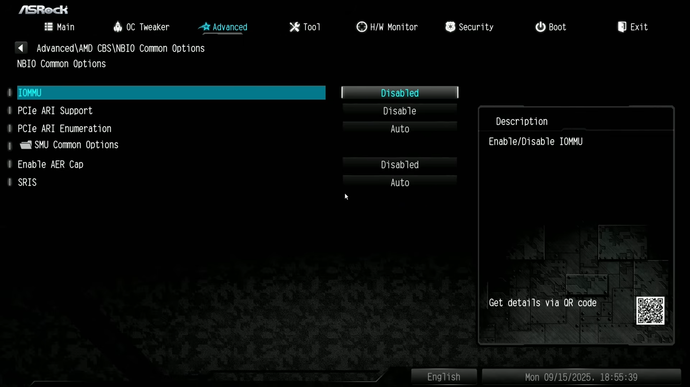
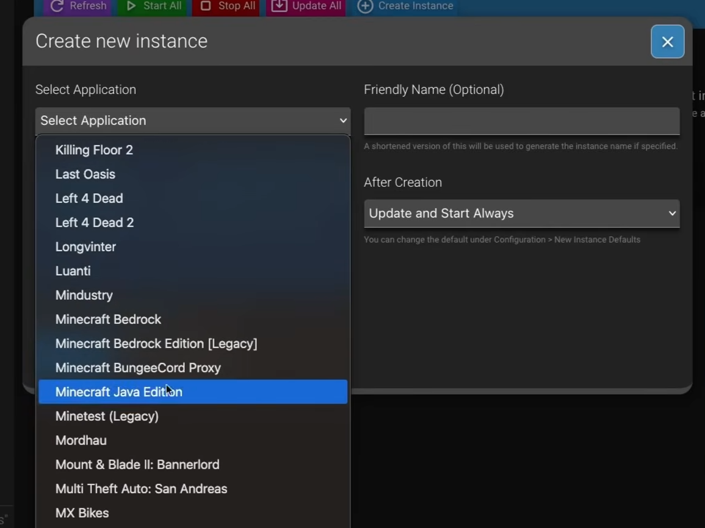

# Build the Ultimate Self-Hosted Gaming & Streaming Server with Proxmox
Reference Video: [Watch the full guide here!](https://www.youtube.com/watch?v=hAqGEUt9V_M)

Imagine a single machine that does it all: hosting persistent game worlds for you and your friends while acting as your own private cloud gaming rig. By building this setup, you stop paying monthly subscription fees for game hosting and break free from your desk. This project transforms your hardware into the ultimate gaming powerhouse, allowing you to stream your entire Steam library to your phone, laptop, or TV with near zero latency, all while running lag-free Minecraft or CS2 servers in the background.

## Overview
This project uses Proxmox to run two distinct systems simultaneously:
 * Game Server Container (LXC): Runs AMP (Application Management Panel) by CubeCoders to easily manage and host game servers.
 * Cloud Gaming VM: Runs Nobara Linux with Sunshine and Moonlight to stream games from the server to your client devices (laptop, phone, etc.), utilizing GPU passthrough.
## Prerequisites
 * Hardware: A server/PC with (preferably) a dedicated GPU (AMD Radeon RX 580 used in the video).
 * OS: Proxmox VE installed.

 Watch [this](https://youtu.be/qmSizZUbCOA?si=QN0rWdMGvcZ_aHm7) video if you are new to Proxmox.

## Part 0: Preparing the Proxmox Host
 You will have to enable IOMMU for GPU passthrough.
 1. Reboot your server and enter the BIOS/UEFI settings.
 2. Locate the IOMMU setting (usually under Advanced or CPU Configuration) and enable it.
 3. Save changes and exit BIOS.

 

 Then enable it in Proxmox by adding it to your GRUB config.
 ```bash
 nano /etc/default/grub
 ```
 Find the line that starts with `GRUB_CMDLINE_LINUX_DEFAULT` and add `intel_iommu=on` (or `amd_iommu=on` for AMD CPUs) to the list of parameters.
 
 Example: `GRUB_CMDLINE_LINUX_DEFAULT="quiet intel_iommu=on"`

 Then update GRUB:
 ```bash
 update-grub
 ```

Next, blacklist the GPU drivers on the Proxmox host so the container can use the GPU.
```bash
echo "blacklist your-gpu-driver" >> /etc/modprobe.d/blacklist.conf
```
For you, replace `your-gpu-driver` with the appropriate driver name (e.g., `amdgpu` for AMD cards).

## Part 1: Setting up the Game Server (AMP)
We will install AMP in an LXC container to run the game server management panel.
### 1. Create the LXC Container
 * Create an LXC container and allocate it resources based on the games you plan to run, we are using 4 CPU cores, 8GB RAM, and 100GB Storage. (Minecraft is RAM heavy)
 * Quick Setup:
 ```bash
 apt update && apt upgrade
 apt install curl
 ```
 You might have to reconfigure your locales as well (The shell script for installing AMP might not work otherwise):
 ```bash
sed -i 's/^[# ]*\(en_US\.UTF-8 UTF-8\)$/\1/' /etc/locale.gen
locale-gen
update-locale LANG=en_US.UTF-8
 ```
### 2. Install AMP (Application Management Panel)
 * Download: Go to the CubeCoders website, pick your linux distribution and copy the Linux installation script.
    * For most of them it's just gonna be `bash <(curl -fsSL getamp.sh)`
 * Install: Paste the script into your LXC console.
 * Configuration:
   * Create an admin user and password.
   * When the installer asks questions, use these selections:
        * Docker -> "No" (since we are using an LXC container).
        * Minecraft server -> "Yes" if you plan to host a Minecraft server. (downloads Java)
        * SteamCMD -> "Yes" if you plan to host a game that requires it (e.g., CS2, Ark).
        * HTTPS -> "Yes" if you need secure connection, but we won't be using it.
 * Web Setup:
   * Go to http://<LXC-IP>:8080 in your browser.
   * Log in and enter your license key (AMP is paid software, ~$10 lifetime).
   * Choose "Standalone" installation. Next.
   * Restart AMP.
### 3. Deploy Game Instances
 * In AMP. Click "Create Instance" and select the game you want to host.

 
### Quick Tour of AMP
- **Status**
  - Your “home” page for the instance: CPU/Memory Usage, Network status, and the main Start/Stop/Restart controls.

- **Console**
  - Live server log output while the server starts/runs.
  - Where you paste admin commands (varies by game) and where you’ll see the *real* reason something failed to boot.

- **Schedule**
  - Set automated tasks like restarts, updates, announcements, backups, or custom commands on a timer.

- **Configuration**
  - User/Role management, Sessions, and other config.

- **Plugins**
  - Manage add-ons/plugin systems supported by that server type.
  - Usually where you enable/disable and update plugins cleanly.

- **Analytics**
  - Basic metrics/history for the instance (uptime, CPU/RAM trends, player activity, etc.).
  - Handy for spotting “this server needs more RAM” or “lag spikes at 9pm”.

- **File Manager**
  - Browse/edit/upload/download server files (configs, mods, worlds/saves).
  - Great when you don’t want to SSH in just to tweak a config.

- **Backups**
  - Create backups and set a backup schedule.
  - If you see “No backup schedule”, set one early — world saves are precious.


> **Tip:** If the server won’t start, go straight to **Console** first — it will almost always tell you what’s wrong.

## Part 2: The Cloud Gaming VM
This VM will act as your personal "Steam Machine" that you can connect to remotely.
### 1. Create the Virtual Machine
 * ISO: Download Nobara Linux (Gaming-optimized Fedora distro).
 * Specs (that we used):
   * 8 CPU Cores.
   * 8GB RAM.
   * Storage: 256GB (or more for games).
 * GPU Passthrough:
   * After creating the VM, do not start it yet.
   * In Nobara VM > Hardware > Click add > PCI Device.
   * Select your GPU (check "All Functions", verify correct Device ID).
   * Note: Ensure "Primary GPU" is checked later once software is set up to avoid black screens during initial config.
### 2. Install & Configure Nobara
 * Installation: Boot the VM and install Nobara.
   * Important: Set the user to Log in automatically. This ensures the streaming software starts even after a reboot without you needing to type a password physically.
 * Post-Install:
   * Update the system using the "Welcome to Nobara" popup.
   * Guest Agent: Install QEMU Guest Agent for better Proxmox integration
        * Inside Nobara terminal:
            ```bash
            sudo dnf install qemu-guest-agent
            ```

   * Enable QEMU Guest Agent in Proxmox VM (nobara) "Options" tab.
   * Ensure media codecs are installed.
### 3. Setup Sunshine (Streaming Host)
 * Install Sunshine: Open the Nobara Software Center, search for "Sunshine", and install it.
 * Configure:
   * Open a browser on the VM and go to https://localhost:47990.
   * Create a username/password for the Sunshine web UI.
 * Client Pairing:
   * Install Moonlight on your client device (Mac, PC, Phone).
   * Moonlight should detect the VM automatically (or add the IP manually).
   * Enter the PIN code shown on Moonlight into the Sunshine web UI to pair.
### 4. Automation (The "Console" Experience)
To make the VM feel like a seamless game console:
 * Steam Big Picture: Install Steam, log in, and enable Proton Experimental in Compatibility settings.
 * Startup Applications: Search for "Startup Applications" in Nobara and add two entries:
   * Sunshine: Command: `sunshine`
   * Steam Big Picture: Command: `steam -gamepadui`
 * Reboot: Restart the VM. It should now boot directly into Steam Big Picture mode and be ready to stream via Moonlight.

## Troubleshooting

* AMP web UI won’t load
    * Confirm container is running and you’re using: http://<LXC-IP>:8080
* Game server won’t start
    * Open Console and look for the first obvious red error line.
    * Most fixes are missing deps, wrong port, or config/plugin issues.
* Moonlight can’t find Sunshine
    * Try adding the VM IP manually in Moonlight.
    * Confirm Sunshine UI loads on the VM at https://localhost:47990.
* Black screen with GPU passthrough
    * Leave “Primary GPU” off for initial setup, then enable it later once drivers/software are set.
## Results
 * Performance: The setup demonstrated smooth 60FPS+ streaming on "Medium/Ultra" settings for titles like Counter-Strike 2, running off an RX 580.
 * Multi-Tasking: The system successfully ran a dedicated CS2 server (via AMP) and the streaming VM simultaneously on the same hardware.

## What You'll End Up With
By the end of this guide you will have:

- A Proxmox host configured for GPU passthrough (IOMMU enabled)
- An LXC container running **AMP** for game servers (Minecraft/CS2/etc.)
- A Nobara VM with **Sunshine** installed as the streaming host
- Moonlight clients paired to the VM for low-latency game streaming

## Where To Go Next
- Add a second game instance (Valheim, CS2, etc.)
- Set a backup schedule in AMP
- Pin your container/VM IPs via DHCP reservation


*Happy Hosting!*